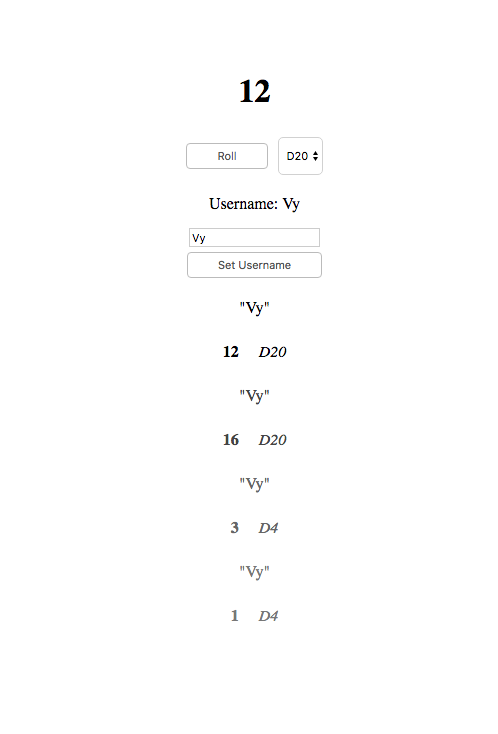

# elm-dice-collab

Standalone Elm client for collaborative dice rolling.

### Installation

- `yarn` or `npm install`
- `elm package install`
- `npm run`
- Visit `http://localhost:8080` in your browser.
